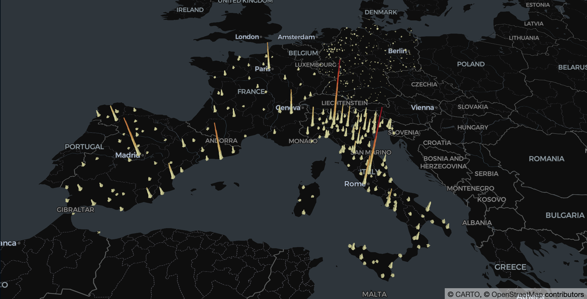

# Credit Risk Analysis - Financial Data Science

 

 

Credit analysis is a type of financial analysis that an investor or bond portfolio manager performs on companies, governments, municipalities, or any other debt-issuing entities to measure the issuer's ability to meet its debt obligations. Credit analysis seeks to identify the appropriate level of default risk associated with investing in that particular entity's debt instruments. 

To judge a company’s ability to pay its debt, banks, bond investors, and analysts conduct credit analysis on the company. Using financial ratios, cash flow analysis, trend analysis, and financial projections, an analyst can evaluate a firm’s ability to pay its obligations. A review of credit scores and any collateral is also used to calculate the creditworthiness of a business. 

The outcome of the credit analysis will determine what risk rating to assign the debt issuer or borrower. The risk rating, in turn, determines whether to extend credit or loan money to the borrowing entity and, if so, the amount to lend.   

If you want to see the presentation, here's the link:
- [.pdf presentation](/presentation/presentation.pdf)

# Why credit risk is so relevant in finance?
Financial institutions used credit risk analysis models to determine the probability of default of a potential borrower. 

The model provides information on the level of a borrower’s credit risk at any particular time. If the lender fails to detect the credit risk in advance, it exposes them to the risk of default and loss of funds. 

Lenders rely on the validation provided by credit risk analysis models to make key lending decisions on whether or not to extend credit to the borrower and the credit to be charged.

With the continuous evolution of technology, banks are continually researching and developing effective ways of modeling credit risk. 

# Project objectives

The primary aim is to understand which are the factors that are effecting more the probability of having an high credit risk of a given company/organization, and build models capable to predict (given some features) the credit risk level.

The credit risk levels (MScores) are ranging from A to D (from A to B low credit risk, from C to D high credit risk).

Different Jupyter Notebooks have been created for different tasks:
- [Data cleansing and manipulation](/notebooks/0-data-cleansing.ipynb)
- [Exploratory analysis](/notebooks/1-exploratory-analysis.ipynb)
- [Machine Learning models](/notebooks/2-ml-models.ipynb)

# Datasets
The main dataset contains the following features (from 2015 to 2020), regarding European companies:
- **Name**: name of the company
- **Turnover**: an accounting concept that calculates how quickly a business conducts its operations.   Most often, it is used to understand how quickly a company collects cash from accounts receivable or how fast the company sells its inventory
- **EBIT**: Earnings Before Interest and Taxes (EBIT) is an indicator of a company's profitability
- **PLTax**: Principal Lifetime income Tax is a new type of tax (proposal) that would tax a person/company based on their cumulative income over their lifetime up until the filing date
- **MScore**: credit risk level of the company (from AAA to D, where D is the highest credit risk level reachable).
- **Region**: city where the company resides
- **Country**: worldwide country of the company
- **NACE code**: is the European statistical classification of economic activities.   NACE groups organizations according to their business activities
- **Sector 1**: very detailed description of the company's business activities (e.g., activities of head offices - management consult; manufacture of leather and related products; wholesale trade - except of motor vehicles; ...)
- **Sector 2**: more general sector membership (e.g., capital goods; energy; diversified finance; ...)
- **Leverage**: a strategy that companies use to increase assets, cash flows, and returns, though it can also magnify losses.  There are two main types of leverage: financial and operating.   To increase financial leverage, a firm may borrow capital through issuing fixed-income securities or by borrowing money directly from a lender
- **ROE**: Return on Equity (ROE) is the measure of a company’s annual return (net income) divided by the value of its total shareholders’ equity, expressed as a percentage.   Alternatively, ROE can also be derived by dividing the firm’s dividend growth rate by its earnings retention rate
- **TAsset**: Total Assets, most commonly used in the context of a corporation, are defined as the assets owned by the entity that has an economic value whose benefits can be derived in the future

Some other accessories datasets have been downloaded from [Kaggle](https://www.kaggle.com/) to extract other useful information to gain more effective insights.

## Where the companies are placed?
In the following figure you can get an idea on where the companies inside the main dataset are geographically located.

 

# Contact
In case you need some further details you can contact directly me.   

***

 

